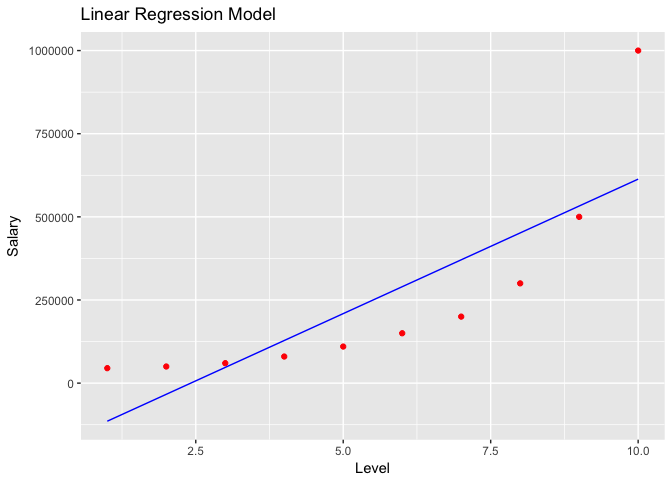
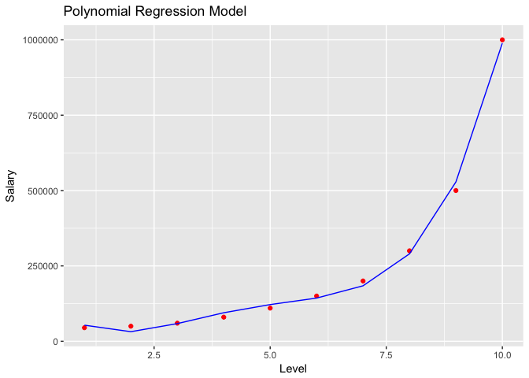

Polynomial Regression
================

``` r
# Data Preprocessing template

# Importing the dataset
setwd("~/Regression Analysis/Data")
dataset = read.csv('Position_Salaries.csv')
dataset = dataset[2:3]

# Splitting the dataset into the Training set and Test set
# install.packages('caTools')
# library(caTools)
# set.seed(123)
# split = sample.split(dataset$Profit, SplitRatio = 0.8)
# training_set = subset(dataset, split == TRUE)
# test_set = subset(dataset, split == FALSE)
# getwd()
# Feature Scaling
# training_set[, 2:3] = scale(training_set[, 2:3])
# test_set[, 2:3] = scale(test_set[, 2:3])
```

Linear vs Polynomial model comparision

``` r
# Linear Regression model

 linReg = lm(formula = Salary ~ . , 
             data = dataset )

summary(linReg)
```

    ## 
    ## Call:
    ## lm(formula = Salary ~ ., data = dataset)
    ## 
    ## Residuals:
    ##     Min      1Q  Median      3Q     Max 
    ## -170818 -129720  -40379   65856  386545 
    ## 
    ## Coefficients:
    ##             Estimate Std. Error t value Pr(>|t|)   
    ## (Intercept)  -195333     124790  -1.565  0.15615   
    ## Level          80879      20112   4.021  0.00383 **
    ## ---
    ## Signif. codes:  0 '***' 0.001 '**' 0.01 '*' 0.05 '.' 0.1 ' ' 1
    ## 
    ## Residual standard error: 182700 on 8 degrees of freedom
    ## Multiple R-squared:  0.669,  Adjusted R-squared:  0.6277 
    ## F-statistic: 16.17 on 1 and 8 DF,  p-value: 0.003833

``` r
# Polynomial Regression model
dataset$level2 = dataset$Level^2
dataset$level3 = dataset$Level^3
dataset$level4 = dataset$Level^4
polyReg = lm(formula = Salary ~ . , 
             data = dataset )
summary(polyReg)
```

    ## 
    ## Call:
    ## lm(formula = Salary ~ ., data = dataset)
    ## 
    ## Residuals:
    ##      1      2      3      4      5      6      7      8      9     10 
    ##  -8357  18240   1358 -14633 -11725   6725  15997  10006 -28695  11084 
    ## 
    ## Coefficients:
    ##              Estimate Std. Error t value Pr(>|t|)   
    ## (Intercept)  184166.7    67768.0   2.718  0.04189 * 
    ## Level       -211002.3    76382.2  -2.762  0.03972 * 
    ## level2        94765.4    26454.2   3.582  0.01584 * 
    ## level3       -15463.3     3535.0  -4.374  0.00719 **
    ## level4          890.2      159.8   5.570  0.00257 **
    ## ---
    ## Signif. codes:  0 '***' 0.001 '**' 0.01 '*' 0.05 '.' 0.1 ' ' 1
    ## 
    ## Residual standard error: 20510 on 5 degrees of freedom
    ## Multiple R-squared:  0.9974, Adjusted R-squared:  0.9953 
    ## F-statistic: 478.1 on 4 and 5 DF,  p-value: 1.213e-06

``` r
######## Visualizing Linear model

#install.packages('ggplot2')
library(ggplot2)
ggplot() +
  geom_point(aes( x= dataset$Level , y= dataset$Salary),
             color = 'Red') +
  geom_line(aes( x= dataset$Level , y= predict(linReg, newdata = dataset) ),
             color = 'Blue')+
  ggtitle("Linear Regression Model") + 
  xlab("Level") + 
  ylab("Salary")
```



``` r
######### Visualizaing Polynimal Reg model

ggplot() +
  geom_point(aes( x= dataset$Level , y= dataset$Salary),
             color = 'Red') +
  geom_line(aes( x= dataset$Level , y= predict(polyReg, newdata = dataset) ),
             color = 'Blue')+
  ggtitle("Polynomial Regression Model") + 
  xlab("Level") + 
  ylab("Salary")
```



Predicting Salary for a random level of 6.5

``` r
### Predicting Salary using linear Reg

y_pred = predict(linReg, newdata = data.frame(Level = 6.5))
### Predicting Salary using Poly Reg
y_pred_poly = predict(polyReg, newdata = data.frame(Level = 6.5,
                                                    level2 = 6.5^2,
                                                    level3 = 6.5^3,
                                                    level4 = 6.5^4))
```
