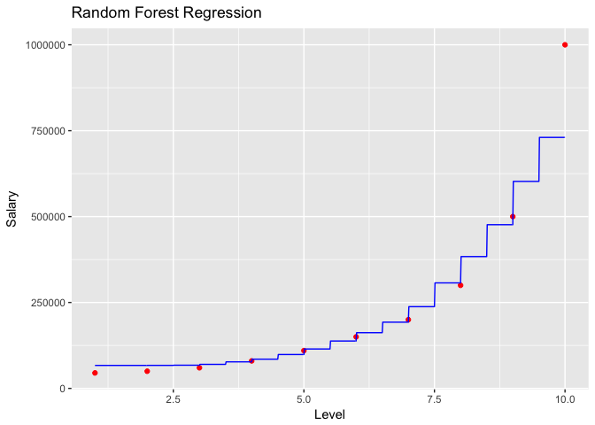

Random Forest Regression
================

``` r
# Importing the dataset
setwd("~/Regression Analysis/Data")
dataset = read.csv('Position_Salaries.csv')
 dataset = dataset[2:3]

# Splitting the dataset into the Training set and Test set
# # install.packages('caTools')
# library(caTools)
# set.seed(123)
# split = sample.split(dataset$Salary, SplitRatio = 2/3)
# training_set = subset(dataset, split == TRUE)
# test_set = subset(dataset, split == FALSE)

# Feature Scaling
# training_set = scale(training_set)
# test_set = scale(test_set)

# Fitting the Regression Model to the dataset

#install.packages('randomForest')
library(randomForest)
```

    ## randomForest 4.6-12

    ## Type rfNews() to see new features/changes/bug fixes.

``` r
set.seed(1234)
regressor = randomForest(x = dataset[1], 
                         y = dataset$Salary,
                         ntree = 1000)

# Predicting a new result
y_pred = predict(regressor, data.frame(Level = 6.5))


# Visualising the Regression Model results (for higher resolution and smoother curve)
# install.packages('ggplot2')
library(ggplot2)
```

    ## 
    ## Attaching package: 'ggplot2'

    ## The following object is masked from 'package:randomForest':
    ## 
    ##     margin

``` r
x_grid = seq(min(dataset$Level), max(dataset$Level), 0.01)
ggplot() +
  geom_point(aes(x = dataset$Level, y = dataset$Salary),
             colour = 'red') +
  geom_line(aes(x = x_grid, y = predict(regressor, newdata = data.frame(Level = x_grid))),
            colour = 'blue') +
  ggtitle('Random Forest Regression') +
  xlab('Level') +
  ylab('Salary')
```


