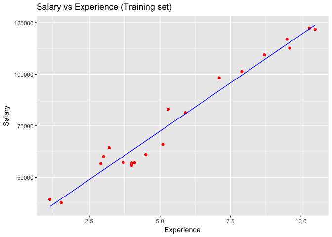
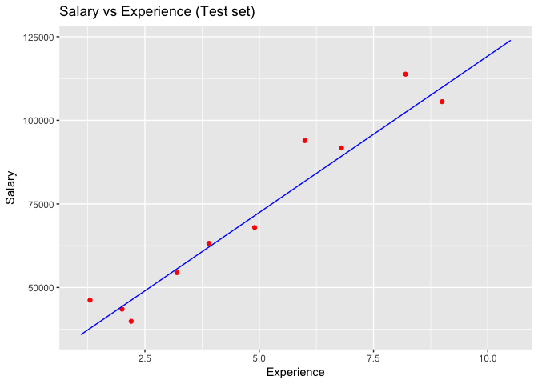

Linear Regression
================

``` r
# Simple Linear Regression
#setwd("~/Regression Analysis")
setwd("~/Regression Analysis/Data")
# Importing the dataset
dataset = read.csv('Salary_Data.csv')
# dataset = dataset[, 2:3]

# Splitting the dataset into the Training set and Test set
#install.packages('caTools')
library(caTools)
set.seed(123)
split = sample.split(dataset$Salary, SplitRatio = 2/3)
training_set = subset(dataset, split == TRUE)
test_set = subset(dataset, split == FALSE)

# Feature Scaling
# training_set[, 2:3] = scale(training_set[, 2:3])
# test_set[, 2:3] = scale(test_set[, 2:3])

#Fitting simple linear regression to training ser

regressor = lm(formula = Salary ~ YearsExperience,
               data = training_set)
#summary(regressor)

y_pred = predict(regressor, newdata = test_set)


#Viz for prediction results

#install.packages('ggplot2')
library(ggplot2)

ggplot() +
  geom_point(aes(x = training_set$YearsExperience, y = training_set$Salary),
             color = 'red') +
  geom_line(aes(x = training_set$YearsExperience, y = predict(regressor, newdata = training_set)),
            color = 'blue') + 
  ggtitle('Salary vs Experience (Training set)') + 
  xlab('Experience') +
  ylab('Salary')
```



``` r
ggplot() +
  geom_point(aes(x = test_set$YearsExperience, y = test_set$Salary),
             color = 'red') +
  geom_line(aes(x = training_set$YearsExperience, y = predict(regressor, newdata = training_set)),
            color = 'blue') + 
  ggtitle('Salary vs Experience (Test set)') + 
  xlab('Experience') +
  ylab('Salary')
```


