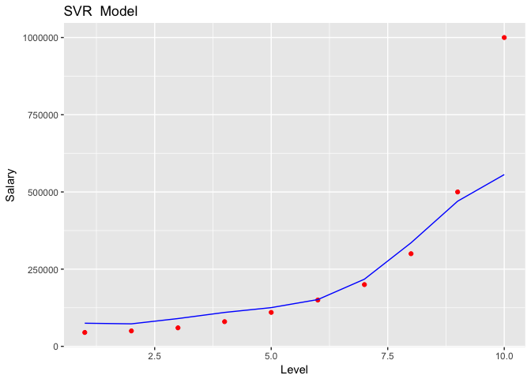

Support Vector Regression
================

"We are about to hire a new employee and he has mentioned that he had a salary of of 160k at his previous job. So when we contacted his previous employer to verify that, we just received a Posotion wise average salary details from his previous employer. The employee was at level 6 in his previous employer. To go from level 6 to level 7 it takes around 4 years and the new employee was already at level 6 for two years. So we are predicting salary for a level of 6.5"

``` r
# Regression
setwd("~/Regression Analysis/Data")
# Importing the dataset
dataset = read.csv('Position_Salaries.csv')
dataset = dataset[2:3]

# Splitting the dataset into the Training set and Test set
# # install.packages('caTools')
# library(caTools)
# set.seed(123)
# split = sample.split(dataset$Salary, SplitRatio = 2/3)
# training_set = subset(dataset, split == TRUE)
# test_set = subset(dataset, split == FALSE)

# Feature Scaling
# training_set = scale(training_set)
# test_set = scale(test_set)

# Fitting the Regression Model to the dataset
# SVR regressor

#install.packages('e1071')
library(e1071)

regressor = svm(formula = Salary ~ . ,
                data = dataset,
                 type = 'eps-regression')
 

 # Predicting results
y_pred = predict(regressor, data.frame(Level = 6.5))

# Visualising the Regression Model results
# install.packages('ggplot2')
library(ggplot2)
ggplot() +
  geom_point(aes(x = dataset$Level, y = dataset$Salary),
             colour = 'red') +
  geom_line(aes(x = dataset$Level, y = predict(regressor, newdata = dataset)),
            colour = 'blue') +
  ggtitle('SVR  Model') +
  xlab('Level') +
  ylab('Salary')
```


